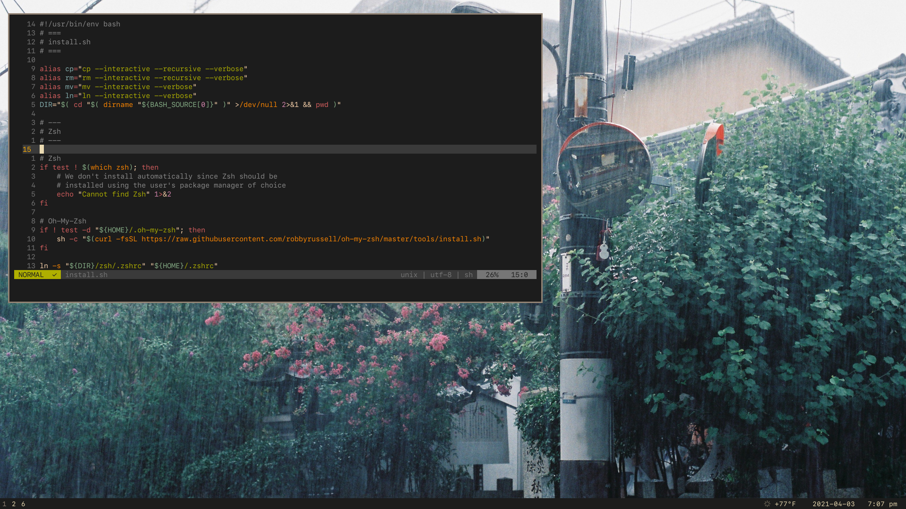

# dotfiles

A collection of my dotfiles for

* Zsh / Oh-My-Zsh
* Vim
* i3-radius
* GNU Make
* X11

## Screenshots



## Installation

```sh
git clone git@github.com:glapa-grossklag/dotfiles.git ~/.dotfiles
chmod +x ./install.sh
./install.sh
```

**Note:** `install.sh` does not install Zsh nor i3-radius, please use your package
manager of choice to do so.
